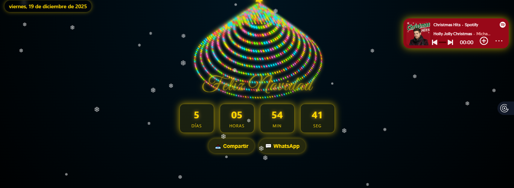

# 🎄 Tarjeta Navideña Animada 3D ✨

¡Bienvenido al repositorio de la **Tarjeta Navideña Animada**! Este es un proyecto web interactivo diseñado para celebrar las fiestas con un árbol de Navidad en 3D, efectos de nieve, música y una cuenta regresiva dinámica.



## 🌟 Características

* **Árbol de Navidad 3D:** Generado dinámicamente con JavaScript y CSS3 (transformaciones en el eje Z).
* **Cuenta Regresiva Inteligente:** Detecta automáticamente si la fecha actual es antes de Navidad o Año Nuevo y ajusta el objetivo.
* **Modo Año Nuevo:** Al llegar a la medianoche del 25 de diciembre, el sitio cambia su temática visual (colores cian/neón) y activa un espectáculo de **fuegos artificiales** en Canvas.
* **Efecto de Nieve:** Animación continua de copos de nieve cayendo en toda la pantalla.
* **Reproductor de Música:** Integración con Spotify para ambientar la experiencia.
* **Diseño Responsivo:** Optimizado para dispositivos móviles y escritorio.
* **Botones de Compartir:** Integración nativa con la API Web Share y acceso directo a WhatsApp.

## 🚀 Tecnologías Utilizadas

* **HTML5:** Estructura semántica y uso de Canvas para fuegos artificiales.
* **CSS3:** Animaciones avanzadas (`@keyframes`), gradientes dinámicos y diseño adaptable (Flexbox/Media Queries).
* **JavaScript (Vanilla):** Lógica del árbol 3D, sistema de partículas de nieve y temporizador en tiempo real.
* **Google Fonts:** Fuente *Great Vibes* para un estilo elegante.

## 🛠️ Instalación y Uso

1.  Clona este repositorio o descarga los archivos.
2.  Asegúrate de que la imagen `preview.png` esté en la misma carpeta que el `index.html`.
3.  Abre el archivo `index.html` en cualquier navegador moderno.

```bash
git clone [https://github.com/tu-usuario/nombre-del-repo.git](https://github.com/tu-usuario/nombre-del-repo.git)
cd nombre-del-repo
open index.html